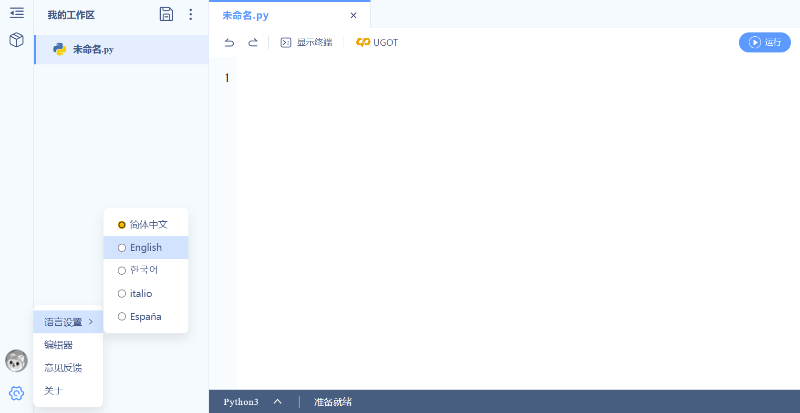
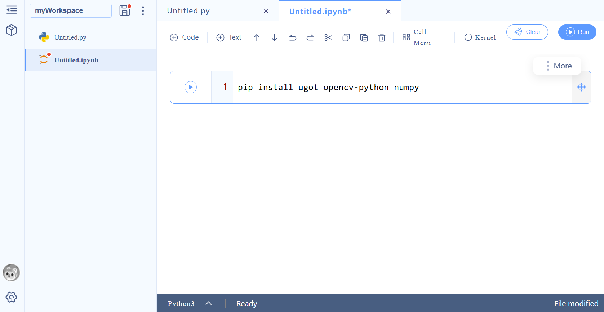

# NUSHigh 2026
Sample code for UGOT control and AI vision.

Each file in the `src` folder contains a program demonstrating a different function.
For UGOT files, the function names indicate the type of UGOT used in the program as follows (note that since the base of the engineering robot is the mecanum wheel car, there is no separate code for the engineering robot chassis movement):
- `SB`: self-balancing vehicle
- `WL`: wheel-legged robot
- `mec`: mecanum wheel car

For example, `UGOT_line_follow.py` contains code for any UGOT robot to follow a line.
Within `UGOT_line_follow.py`, the function `line_follow_SB()` is used specifically for the self-balancing car.

If there is no robot specified in the function name, the code is valid for all types of robots, or does not need a robot.

You should upload or create the `constants.py` file in UPython before using any of the main UGOT program files. Change the `ROBOT_TYPE` and `IP_ADDRESS` variables according to the robot you are using.

For more information on the UGOT functions, see the [documentation](https://docs.ubtrobot.com/ugot/#/en-us/extension/python_sdk/version).
Most of the commands that you will need can be found in the [motion (Sports)](https://docs.ubtrobot.com/ugot/#/en-us/extension/python_sdk/model), [AI vision](https://docs.ubtrobot.com/ugot/#/en-us/extension/python_sdk/vision), [screen](https://docs.ubtrobot.com/ugot/#/en-us/extension/python_sdk/screen), [sound and light](https://docs.ubtrobot.com/ugot/#/en-us/extension/python_sdk/light), and [sensor](https://docs.ubtrobot.com/ugot/#/en-us/extension/python_sdk/sensor) sections.

## Getting started
1. Visit the UPython [website](py.ubtrobot.com/gl). 
2. Change the language using the settings at the bottom left corner of the screen.
3. (Optional) Create an account using your personal (not school) email or phone number to save your code to the cloud. If you do not create an account, make sure to regularly export your workspace to a `.upy` file.
4. Create a new `.ipynb` file and paste the following command in a cell: 
```bash 
pip install ugot opencv-python mediapipe fer speech_recognition pyttsx3 
```


5. Click the triangle next to the cell to execute. You only need to do this once per computer. If you need to install additional packages, just change the package names in the command, e.g. `pip install package_name`.
6. Upload or create your Python files in the file explorer on the left.

Happy coding!